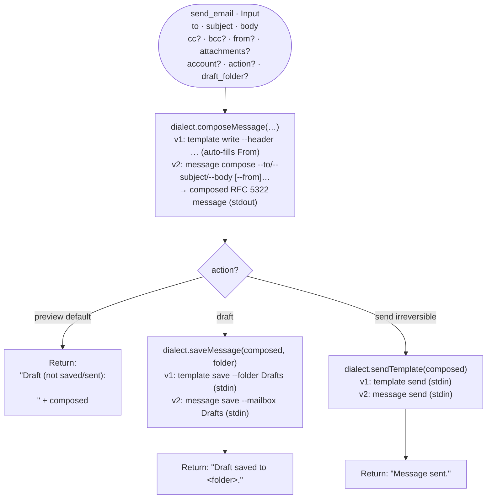
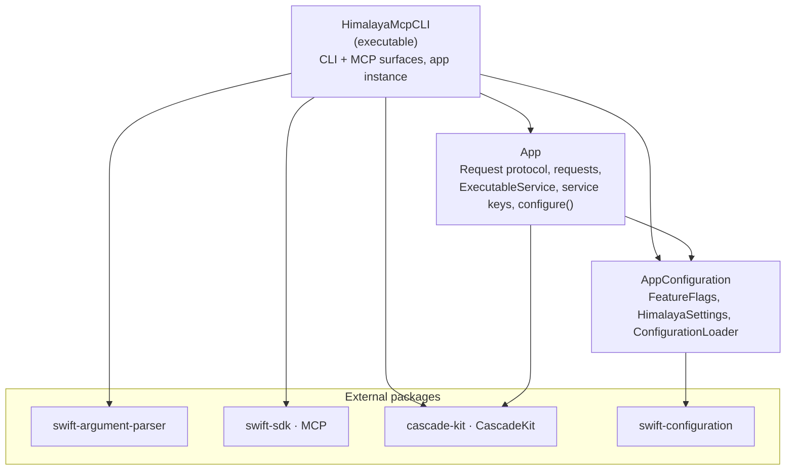
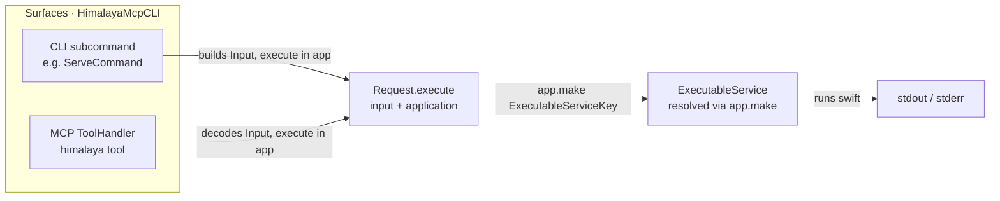
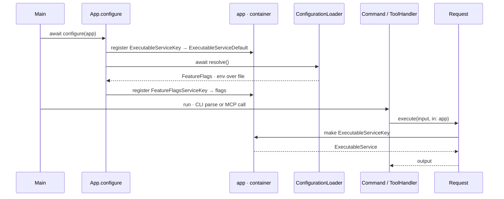

# HimalayaMcpCLI

A single Swift executable that works **both** as a classic command-line tool and as a
[Model Context Protocol](https://modelcontextprotocol.io) (MCP) server — sharing one
implementation for every feature.

- **CLI** — powered by [`swift-argument-parser`](https://github.com/apple/swift-argument-parser).
- **MCP server** — powered by the [`swift-sdk`](https://github.com/modelcontextprotocol/swift-sdk).
- **Dependency injection** — Vapor-style container from [`cascade-kit`](https://github.com/amine2233/cascade-kit).
- **Configuration & feature flags** — from [`swift-configuration`](https://github.com/apple/swift-configuration).

The core idea: every feature is written **once** as a `Request` and exposed **twice** — as a CLI
subcommand and as an MCP tool — so the two surfaces can never drift apart.

---

## What it does

Each feature is a `Request` that drives the [`himalaya`](https://github.com/pimalaya/himalaya)
CLI through the injected `HimalayaService`, and is exposed as an MCP tool.

| MCP tool | Arguments | himalaya command |
|----------|-----------|------------------|
| `list_emails` | `folder?`, `page_size?`, `page?`, `account?` | `envelope list` |
| `search_emails` | `query`, `folder?`, `account?` | `envelope list <query…>` |
| `read_email` | `id`, `folder?`, `account?` | `message read <id> --no-headers` |
| `read_email_html` | `id`, `folder?`, `account?` | `message export <id>` → HTML part |
| `list_folders` | `account?` | `folder list` |
| `create_folder` | `name`, `account?` | `folder add <name>` |
| `delete_folder` | `name`, `account?` | `folder delete <name>` |
| `flag_email` | `id`, `flags`, `action` (`add`\|`remove`), `folder?` | `flag add\|remove <id> <flags…>` |
| `move_email` | `id`, `target_folder`, `folder?`, `account?` | `message move <target> <id>` |
| `send_email` | `to`, `subject`, `body`, `cc?`, `bcc?`, `from?`, `attachments?`, `action?`, `draft_folder?`, `account?` | v1 `template write` (+`save`/`send`) · v2 `message compose` (+`save`/`send`) |
| `draft_reply` | `id`, `body?`, `reply_all?`, `folder?`, `account?` | `template reply <id>` → template |
| `send_template` | `template` \| `template_file`, `attachments?`, `confirm`, `account?` | `template send` / `message send` |
| `list_attachments` | `id`, `folder?`, `account?` | `attachment download` → temp dir |
| `download_attachment` | `id`, `filename`, `folder?`, `account?` | `attachment download` → temp dir |
| `delete_email` **(experimental)** | `ids`, `folder?`, `account?` | `message delete <id…>` |

The `himalaya` binary is located via `$HIMALAYA_BIN_PATH` (if set, it wins) and otherwise by
searching `PATH`. Notes on the less obvious mappings:

- `search_emails` takes a himalaya filter/sort query (e.g.
  `from alice and subject invoice order by date desc`), split into tokens.
- `send_email` composes from structured fields and, per its `action`, **previews** (default — returns
  the composed message, nothing sent/saved), saves a **draft** (to `Drafts`, override with
  `draft_folder`), or **sends** it. On v1 himalaya auto-fills `From`; on v2 pass `from` for
  draft/send. Attachments are native on v2 (`--attach`) and MML `<#part>` on v1.
- `draft_reply` still produces a reply **template** (feed it to `send_template`); `send_template` sends
  a raw/bring-your-own message (needs `confirm=true`).
- himalaya has no per-attachment listing/selection, so `list_attachments` and
  `download_attachment` download into a throwaway directory and inspect the result.
- `delete_email` is **irreversible** and therefore experimental: it is hidden from `tools/list`
  (and rejected if called) unless `experimental.enabled` / `EXPERIMENTAL_ENABLED=true` is set.

Experimental features are gated behind a configuration flag — hidden from `--help` / `tools/list`
and rejected if invoked — unless `experimental.enabled` is on.

### Folders & labels

himalaya has no separate "label" concept — **labels are folders**. On Gmail-style accounts,
each label is exposed as a folder, typically under a `Labels/` prefix (e.g. `Labels/Important`,
`Labels/Newsletters`), alongside system folders like `INBOX`, `Archive`, `Sent`, `All Mail`,
`Starred`, `Spam`, `Trash`. So every `folder` argument accepts a label path, and:

- **List a label's mail** → `list_emails` with `folder: "Labels/Important"`.
- **Apply a label** (move onto it) → `move_email` with `target_folder: "Labels/Follow Up"`.
- **Create / delete a label** → `create_folder` / `delete_folder` with a `Labels/…` name.
- **Archive** → `move_email` with `target_folder: "Archive"` (there is no dedicated archive command;
  archiving is a move to the `Archive` folder).
- **Flag / unflag** → `flag_email` with `action: "add" | "remove"` and flags like `Seen`, `Flagged`,
  `Answered` (starring in Gmail terms is the `Flagged` flag, or a move to the `Starred` folder).

### Messages vs templates

himalaya distinguishes two things, and mixing them up is a common source of send failures:

- A **raw message** is a finished RFC 5322 message — real headers and a body, already MIME-encoded.
  Sent with `himalaya message send`.
- A **template** is a *source* for a message: headers plus a body that may use **MML** (MIME Meta
  Language, e.g. `<#part filename="/path/to/file">` to attach a file). himalaya **compiles** a
  template into a MIME message before sending. Generated by `template write` / `template reply`, and
  sent with `himalaya template send`.

This server composes with **templates** (v1) / **messages** (v2): `send_email` builds the message from
structured fields, and `draft_reply` emits a reply template (both use `template write`/`template reply`
on v1 — *not* `message write`, which would open an editor — and `message compose` on v2). Sending a v1
template through `message send` fails, because the MML/template isn't a valid raw message; the dialect
picks the right send command per version.

### Composing & sending (`send_email`)

`send_email` is the single tool for outgoing mail. It **always composes first** from structured fields
(`to`, `subject`, `body`, optional `cc`/`bcc`/`from`/`attachments`), then does one of three things based
on **`action`** (default `preview`):

| `action` | What happens | himalaya (v1 · v2) | Reversible? |
|----------|--------------|--------------------|-------------|
| `preview` *(default)* | Returns the composed message for review — **nothing is saved or sent** | `template write` · `message compose` | — |
| `draft` | Saves the composed message to the **`Drafts`** mailbox (override with `draft_folder`) | `template save --folder` · `message save --mailbox` (stdin) | Yes — it's just a draft |
| `send` | **Sends** the message — irreversible | `template send` · `message send` (stdin) | **No** |

The **`from`** address is optional: on **v1** himalaya auto-fills `From`, so it can stay unset; on **v2**
a sender is required for `draft`/`send`. Attachments are **native** on v2 (`--attach <path>`) and
appended as **MML** (`<#part filename="…">`) on v1.



The typical safe flow is **preview → review → draft or send**:

```jsonc
// 1) preview — build it, read it back, nothing leaves your machine
// tool: send_email
{ "to": "alice@example.com", "subject": "Report", "body": "Hi Alice,\n\nSee attached.",
  "attachments": ["/Users/me/report.pdf"], "account": "work" }

// 2) save it as a real draft in the Drafts mailbox
{ "to": "alice@example.com", "subject": "Report", "body": "Hi Alice,\n\nSee attached.",
  "attachments": ["/Users/me/report.pdf"], "account": "work", "action": "draft" }

// 3) send it (irreversible)
{ "to": "alice@example.com", "subject": "Report", "body": "Hi Alice,\n\nSee attached.",
  "attachments": ["/Users/me/report.pdf"], "account": "work", "action": "send" }
```

Notes:
- `action: "preview"` runs himalaya **once** (compose only); `draft`/`send` run it **twice** (compose,
  then save/send).
- Override the destination draft mailbox with `draft_folder` (e.g. `"[Gmail]/Drafts"`).
- To send a message you authored yourself (raw template, your own MML), use `send_template` instead.

#### Sending a raw template (`send_template`)

Use `send_template` to send a template you author yourself (or one produced by `draft_reply`). Provide it
**inline** or **from a file**, and — because sending can't be undone — set `confirm: true`.

**Inline template:**

```jsonc
// tool: send_template
{
  "template": "To: alice@example.com\nSubject: Report\n\nHi Alice,\n\nSee attached.\n<#part filename=\"/Users/me/report.pdf\"><#/part>",
  "confirm": true
}
```

**From a file** (write the template to `draft.eml`, then send it):

```jsonc
// tool: send_template
{ "template_file": "/Users/me/draft.eml", "confirm": true }
```

`attachments` (a list of absolute paths) is appended to the body as MML, so you don't have to write
the `<#part>` directives by hand:

```jsonc
{ "template": "To: alice@example.com\nSubject: Files\n\nAttached.", "attachments": ["/Users/me/a.pdf"], "confirm": true }
```

Notes:
- Provide **either** `template` **or** `template_file`, not both.
- Without `confirm: true`, nothing is sent — the tool returns a refusal string.
- Override the sending account with `account`; otherwise the default (or `HIMALAYA_ACCOUNT`) is used.
- For structured composition, prefer `send_email` (`action: preview | draft | send`); reach for
  `send_template` only when you need to send a raw message you authored yourself.

---

## Architecture

### Modules



- **`AppConfiguration`** — dependency-light. Resolves `FeatureFlags` and `HimalayaSettings` from the
  environment layered over an optional JSON file (`ConfigurationLoader.resolveAll()`).
- **`App`** — the domain. The `Request` protocol and its implementations, the `ExecutableService`
  abstraction (+ live `ExecutableServiceDefault`), the DI service keys, and the Vapor-style
  `configure(_:)` that registers everything into a container.
- **`HimalayaMcpCLI`** — the executable. Owns the shared `app` container, wires the CLI subcommands and
  the MCP server, and calls `configure(app)` at startup.

### The "write once, expose twice" pattern



Both surfaces construct the same typed `Input` and call the same `Request`, which resolves the
`ExecutableService` from the container — so behaviour is identical however the tool is invoked.

### Dependency injection (Vapor-style)

`configure(_:)` registers services into the container once at startup; everything else resolves
them with `make`.



> **Note on naming:** CascadeKit's container types are named `Application` and `Request` — the same
> as our `Request` protocol. We keep our `Request` (a module's own declaration shadows the imported
> one) and refer to the container simply as `Application`.

---

## Requirements

- Swift 6.0+ toolchain
- macOS 15+ (required by `swift-configuration` 1.0)
- The [`himalaya`](https://github.com/pimalaya/himalaya) CLI, installed and configured with at least
  one account — the server shells out to it (found via `PATH` or `$HIMALAYA_BIN_PATH`)
- The [`mml`](https://github.com/pimalaya/mml) binary (**required on both v1 and v2**) — compiles MML
  templates into MIME before sending. Without it, `send_template` will fail with an actionable error.
  Install with:
  ```bash
  cargo install mime-meta-language --locked --features cli
  ```
  > The crate is named `mime-meta-language`, but the installed binary is `mml`.
  > The `--features cli` flag is **mandatory** — without it only the library is built, no binary.
- Optional: [`mise`](https://mise.jdx.dev) to run the build/install tasks below

## Installing the himalaya CLI

This server shells out to the [`himalaya`](https://github.com/pimalaya/himalaya) binary, so install it
first and configure at least one account. Pick the version that matches how you set `HIMALAYA_VERSION`
(the MCP server **defaults to v1**).

### himalaya v1 (stable — default)

```bash
# Homebrew (macOS/Linux) — ships the 1.x line
brew install himalaya

# or with Cargo, pinned to the 1.x line
cargo install himalaya --version '^1' --locked
```

Leave `HIMALAYA_VERSION` at its default (`v1`).

### himalaya v2 (alpha — OAuth2 backends: Outlook / Microsoft 365, Gmail, JMAP)

v2 adds first-class **OAuth2** authentication and new backends — notably **Microsoft Graph**
(`+msgraph`, i.e. Outlook / Microsoft 365 / Office 365), **Gmail** (`+gmail`), and **JMAP** — alongside
IMAP/SMTP/Maildir. If your provider requires OAuth2 (Outlook, Gmail, Fastmail, …), use v2:

```bash
# Cargo — pre-release versions must be requested explicitly
cargo install himalaya --version '2.0.0-alpha.1' --locked

# or build the latest from source
cargo install --git https://github.com/pimalaya/himalaya --locked
```

Then tell the MCP server to speak v2:

```bash
HIMALAYA_VERSION=v2   # env var, or "himalaya.version": "v2" in the config file
```

> v2 is **alpha**: a few tools have no v2 equivalent yet and return a clear "not supported on
> himalaya v2" error (see [himalaya v1 vs v2](#himalaya-v1-vs-v2)). Check your installed version and
> its compiled features with `himalaya --version` (e.g. `+msgraph +gmail +imap +smtp`), and verify
> connectivity with `himalaya-mcp doctor`.

## Install

**Recommended — per-user install to `~/.local/bin` (via mise).** This keeps the binary in your home
directory (no `sudo`, nothing installed machine-wide):

```bash
mise run install                          # build -c release → ~/.local/bin/himalaya-mcp
mise run install --bin-path /usr/local/bin # …or install to a specific directory
mise run setup-path                       # optional: add ~/.local/bin to PATH in your shell profile
```

`mise run install` builds the release binary and copies it to `~/.local/bin/himalaya-mcp`. Pick a
different directory with `--bin-path <dir>` (or `INSTALL_DIR=/some/dir mise run install`);
`mise run uninstall [--bin-path <dir>]` removes it. `~/.local/bin` is already on `PATH` inside this
project's mise environment; `setup-path` makes that permanent for your interactive shells.
Run `mise tasks` to see everything (`build`, `test`, `run`, `install`, `uninstall`, `setup-path`,
`mcp-add`).

**Manual — without mise:**

```bash
swift build -c release
mkdir -p "$HOME/.local/bin"
install -m 0755 "$(swift build -c release --show-bin-path)/HimalayaMcpCLI" "$HOME/.local/bin/himalaya-mcp"
```

**Development build** (run in place, no install):

```bash
swift build            # debug
swift run HimalayaMcpCLI --help
```

## Usage as a CLI

```bash
himalaya-mcp --help           # if installed on PATH (mise run install)
swift run HimalayaMcpCLI --help   # or run in place from the source tree
```

Besides `serve`, the CLI ships management commands:

```bash
himalaya-mcp doctor                  # check himalaya + all accounts are reachable
himalaya-mcp doctor --account work   # check only one account
himalaya-mcp doctor --json           # machine-readable report (exit code non-zero on problems)

himalaya-mcp setup                   # add/update the entry in Claude Desktop's config
himalaya-mcp setup --check           # verify that entry
himalaya-mcp setup --remove          # remove it
```

`doctor` resolves the `himalaya` binary, discovers accounts via `himalaya account list`, and probes
each by listing its folders — reporting reachability per account (add `--json` for scripting/CI).

## Usage as an MCP server

```bash
himalaya-mcp serve            # installed binary
swift run HimalayaMcpCLI serve    # or from the source tree
```

`serve` speaks JSON-RPC over **stdio**; an MCP host launches it for you. Manual smoke test:

```bash
BIN="$HOME/.local/bin/himalaya-mcp"   # or "$(swift build --show-bin-path)/HimalayaMcpCLI"
{
  printf '%s\n' '{"jsonrpc":"2.0","id":1,"method":"initialize","params":{"protocolVersion":"2025-06-18","capabilities":{},"clientInfo":{"name":"smoke","version":"0.0.1"}}}'
  printf '%s\n' '{"jsonrpc":"2.0","method":"notifications/initialized"}'
  printf '%s\n' '{"jsonrpc":"2.0","id":2,"method":"tools/list"}'
  sleep 1
} | "$BIN" serve
```

> **Note:** in `serve` mode stdout is reserved for the JSON-RPC stream — never `print(...)` to
> stdout while serving; send logging to **stderr**.

### Claude Code integration

After `mise run install`, register the installed binary (user scope) — or just run `mise run mcp-add`,
which does the same:

```bash
claude mcp add himalaya-mcp -- "$HOME/.local/bin/himalaya-mcp" serve
```

Or use a `.mcp.json` (this repo's is git-ignored, since it holds a machine-specific absolute path):

```json
{
  "mcpServers": {
    "himalaya-mcp": {
      "command": "/Users/you/.local/bin/himalaya-mcp",
      "args": ["serve"],
      "env": { "EXPERIMENTAL_ENABLED": "true" }
    }
  }
}
```

### Claude Desktop integration

**Easiest — let the CLI do it.** After installing the binary, run:

```bash
himalaya-mcp setup            # add/update the himalaya-mcp entry in Claude Desktop's config
himalaya-mcp setup --check    # verify the entry (paths exist & are runnable); non-zero exit if not
himalaya-mcp setup --remove   # remove the entry
```

`setup` writes an entry pointing at the running binary, resolves `himalaya` (via `PATH` /
`$HIMALAYA_BIN_PATH`) and bakes it into the entry's `env` so Claude Desktop — which doesn't inherit
your shell `PATH` — can find it. It merges into the existing config (other servers/preferences are
preserved) and, by default, targets the OS location below (override with `--config <path>`). Restart
Claude Desktop afterward.

**Manual alternative.** Add the server to Claude Desktop's config yourself, then restart it:

- **macOS:** `~/Library/Application Support/Claude/claude_desktop_config.json`
- **Windows:** `%APPDATA%\Claude\claude_desktop_config.json`

```json
{
  "mcpServers": {
    "himalaya-mcp": {
      "command": "/Users/you/.local/bin/himalaya-mcp",
      "args": ["serve"],
      "env": {
        "HIMALAYA_BIN_PATH": "/opt/homebrew/bin/himalaya",
        "PATH": "/opt/homebrew/bin:/usr/local/bin:/usr/bin:/bin",
        "HIMALAYA_FOLDER": "INBOX",
        "HIMALAYA_TIMEOUT": "120000",
        "EXPERIMENTAL_ENABLED": "false"
      }
    }
  }
}
```

> **Important:** use **absolute paths** — Claude Desktop is a GUI app and does **not** inherit your
> shell `PATH`, so `himalaya` won't be found unless you set `HIMALAYA_BIN_PATH` (and add its directory
> to `PATH` for its own runtime deps). Merge the `himalaya-mcp` entry into any existing `mcpServers`
> rather than replacing the file. A ready-to-edit copy lives at
> [`examples/claude_desktop_config.json`](examples/claude_desktop_config.json). Set
> `EXPERIMENTAL_ENABLED` to `"true"` only if you want the irreversible `delete_email` tool exposed.

---

## Example prompts

Once the server is connected, drive it with natural language from your MCP host (Claude Code, an
IDE, …). A good archive-and-flag prompt is explicit about **scope**, **action**, and **confirmation**,
since some actions are irreversible:

> **Archive & flag prompt**
>
> Go through my INBOX and help me triage:
> 1. Find every unread email from GitHub notifications (`search_emails` with `from github`).
> 2. Show me the list first — subject, sender, date — and **wait for my confirmation**.
> 3. On my OK, mark them all read (`flag_email` `action: "add"`, `flags: "Seen"`) and archive them
>    (`move_email` `target_folder: "Archive"`).
> 4. For anything that looks important (security, receipts, a real person), **don't touch it** — list
>    those separately so I can decide.

More focused variants you can paste and tweak:

- **Archive a sender:** "Archive all emails from `noreply@setapp.com` — show me the list before moving
  them to `Archive`."
- **Flag for follow-up:** "Flag emails 228 and 15 as `Flagged` and move them to `Labels/[01] Follow Up`."
- **Star = flag:** "Star (flag as `Flagged`) every email from my manager this week."
- **Mark read + archive a label:** "In `Labels/Newsletters`, mark everything as `Seen` and archive it."
- **Clean up, safely:** "Find read newsletters older than 30 days, list them, and after I confirm,
  archive them."

> **Tip:** always ask the assistant to **list matches and wait for confirmation** before archiving,
> flagging, or (especially) deleting — archive/flag are reversible, `delete_email` is not.

### Prompt library

Reusable, named prompts built on the tools above. Invoke one by name with its arguments (e.g.
"run `triage_inbox` with count=20") and the assistant fills in the rest. All are **read-only**
unless you explicitly approve an action.

| Prompt | Arguments | Purpose |
|--------|-----------|---------|
| `triage_inbox` | `count=10` | Classify recent emails: actionable / FYI / skip |
| `summarize_email` | `id`, `folder?` | One-sentence summary + action items for a message |
| `daily_email_digest` | — | Priority-grouped markdown digest of the inbox |
| `draft_reply` | `id`, `tone?`, `instructions?` | Guided reply composition (does not send) |
| `morning_briefing` | `account?` | Morning briefing with urgency classification |
| `inbox_check` | `folder?`, `account?` | Quick inbox status + highlights |

<details>
<summary><code>triage_inbox</code> — Classify emails: actionable / FYI / skip</summary>

> List the latest `{count=10}` emails from my INBOX (`list_emails` with `page_size={count}`). For
> each, classify it as **Actionable** (needs a reply or task), **FYI** (read-only, keep), or **Skip**
> (newsletter/promo/noise). Return a table: id · from · subject · class · one-line reason. Don't move,
> flag, or delete anything — just propose what I could archive/flag, and wait for my go-ahead.

</details>

<details>
<summary><code>summarize_email</code> — One-sentence summary + action items</summary>

> Read email `{id}` (in `{folder=INBOX}`) with `read_email`. Give me: (1) a **one-sentence summary**,
> (2) a bullet list of **action items / requests** directed at me (empty if none), and (3) any
> deadline or date mentioned. Keep it tight — no quoting the whole message.

</details>

<details>
<summary><code>daily_email_digest</code> — Priority-grouped markdown digest</summary>

> Build a markdown digest of my current INBOX (use `list_emails`, and `read_email` only where a
> subject is ambiguous). Group by priority — **🔴 Needs action**, **🟡 Worth a look**, **⚪ FYI /
> noise** — and within each group list `from — subject` (id). End with a 2–3 line "bottom line" of
> what deserves my attention today. Read-only.

</details>

<details>
<summary><code>draft_reply</code> — Guided reply composition</summary>

> Draft a reply to email `{id}` (in `{folder=INBOX}`) using `draft_reply`. Tone: `{tone=friendly and
> concise}`. Extra guidance: `{instructions}`. First show me the original's key points, then the
> proposed reply as a template. **Do not send** — I'll review, and only send via `send_email` with
> `action: "send"` once I approve.

</details>

<details>
<summary><code>morning_briefing</code> — Morning briefing with urgency classification</summary>

> Give me a morning briefing for account `{account=default}`. Pull today's and yesterday's unread mail
> (`search_emails` with a recent-date query), then classify each as **Urgent** (time-sensitive / from a
> person awaiting me), **Today** (handle before EOD), or **Later**. Lead with a one-paragraph summary,
> then the grouped list. Flag anything that looks like a deadline, meeting, or security alert.

</details>

<details>
<summary><code>inbox_check</code> — Quick inbox status + highlights</summary>

> Quick status of `{folder=INBOX}` for account `{account=default}`: how many unread, and the top 5
> most notable messages right now (sender · subject · why it stands out). One short paragraph, no
> table. Read-only.

</details>

---

## Configuration

Settings are read with `swift-configuration`. A `ConfigReader` is resolved once at startup from two
layered providers — **environment variables first** (highest precedence), then an optional **JSON
file**:

| Key | Env var | JSON path | Default |
|-----|---------|-----------|---------|
| `experimental.enabled` | `EXPERIMENTAL_ENABLED` | `experimental.enabled` | `false` |
| Default account | `HIMALAYA_ACCOUNT` | `himalaya.account` | system default |
| Default folder | `HIMALAYA_FOLDER` | `himalaya.folder` | `INBOX` |
| Command timeout (ms) | `HIMALAYA_TIMEOUT` | `himalaya.timeout` | `120000` (2 min; `0` = unlimited) |
| himalaya CLI version | `HIMALAYA_VERSION` | `himalaya.version` | `v1` (accepts `v1`/`1`, `v2`/`2`) |

Also: `HIMALAYA_BIN_PATH` overrides binary discovery (see [What it does](#what-it-does)).

The config file is `himalaya-mcp.json` in the working directory, or the path in `$HIMALAYA_MCP_CONFIG`. A
missing file is fine; env always wins over the file.

```json
{
  "experimental": { "enabled": true },
  "himalaya": { "account": "work", "folder": "INBOX", "timeout": 120000 }
}
```

`HIMALAYA_ACCOUNT` / `HIMALAYA_FOLDER` default the account/mailbox on every command when a call omits
them. `HIMALAYA_TIMEOUT` bounds each subprocess; exceeding it terminates the command and returns a
timeout error.

### himalaya v1 vs v2

himalaya v1 and v2 have materially different command surfaces. The version is selected by
`HIMALAYA_VERSION` (**default `v1`**), and each version's commands are built by a `HimalayaDialect`
implementation (`HimalayaDialectV1` / `HimalayaDialectV2`) — the single seam where every difference
lives, so adding or fixing a version is a localized change. Requests depend only on the protocol.

Notable v1 → v2 changes handled by the dialect:

| Operation | v1 | v2 |
|-----------|-----|-----|
| Folders | `folder list/add/delete`, `--folder` | `mailbox list`, `--mailbox` |
| Search | `envelope list <query>` | `envelope search <query>` |
| Flags | `flag add <id> <flag…>` | `flag add --flag <F> … <id>` |
| Move | `message move <target> <id>` | `message move --to <t> --from <src> <id>` |
| Send | `template send` (stdin) | `message send` (stdin) |
| JSON | `-o json` | `--json` |

Some v1 features have no v2 equivalent yet (v2 is alpha): `read_email_html` (no `message export`),
`create_folder` / `delete_folder`, `draft_reply` (the `template reply` command is gone), and
`delete_email` (no `message delete`). On v2 these tools return a clear
*"… is not supported on himalaya v2"* error. `send_email` works on **both** versions (v1 via the
`template` family, v2 via the `message` family). Set `HIMALAYA_VERSION=v2` only if you run himalaya v2.

### Experimental features

When `experimental.enabled` is **true**, experimental surfaces are exposed; when false they are
hidden (absent from `--help` / `tools/list`, unknown if invoked). Mark a `ToolHandler` with
`isExperimental: true` (or gate a subcommand behind the flag) to place it behind this switch.

```bash
EXPERIMENTAL_ENABLED=true "$HOME/.local/bin/himalaya-mcp" serve
```

---

## Adding a new feature

The pattern is "write once, expose twice":

1. **Core** — add a `Request` in `Sources/App/Requests/`, resolving services via
   `application.make(...)`.
2. **Register** — if it needs a new service, register it in `configure(_:)` (`Sources/App/Configure.swift`).
3. **CLI** — add a `ParsableCommand` in `Sources/HimalayaMcpCLI/Commands/` that calls
   `execute(input, in: app)`, and register it in the root command's `subcommands`.
4. **MCP** — add a `ToolHandler` in `Sources/HimalayaMcpCLI/MCP/ToolHandler.swift` (set
   `isExperimental: true` to gate it) that calls the same `Request`.

Both surfaces share the new feature with zero duplicated logic.

---

## Tests

```bash
swift test        # or: mise run test
```

Tests are split per module (`AppTests`, `AppConfigurationTests`, `HimalayaMcpCLITests`). Requests are
exercised hermetically by registering a **stub `ExecutableService`** in a container — no real
`swift` shell-out.
