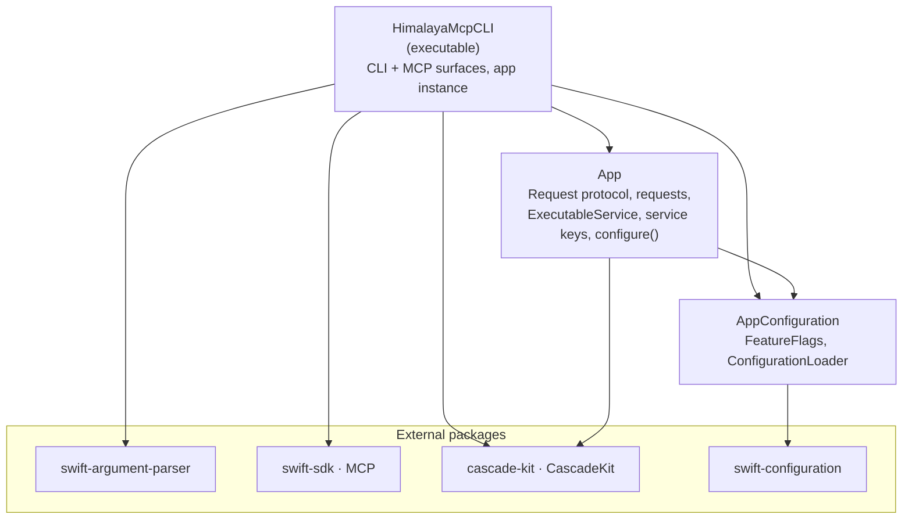
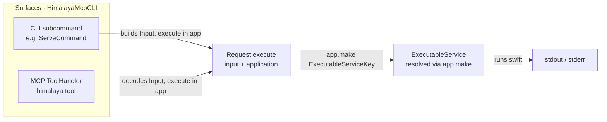
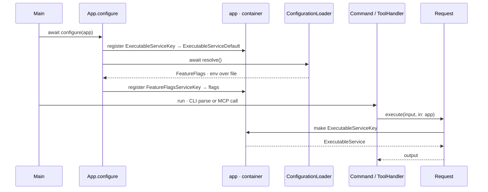

# HimalayaMcpCLI

A single Swift executable that works **both** as a classic command-line tool and as a
[Model Context Protocol](https://modelcontextprotocol.io) (MCP) server — sharing one
implementation for every feature.

- **CLI** — powered by [`swift-argument-parser`](https://github.com/apple/swift-argument-parser).
- **MCP server** — powered by the [`swift-sdk`](https://github.com/modelcontextprotocol/swift-sdk).
- **Dependency injection** — Vapor-style container from [`cascade-kit`](https://github.com/amine2233/cascade-kit).
- **Configuration & feature flags** — from [`swift-configuration`](https://github.com/apple/swift-configuration).

The core idea: every feature is written **once** as a `Request` and exposed **twice** — as a CLI
subcommand and as an MCP tool — so the two surfaces can never drift apart.

---

## What it does

Each feature is a `Request` that drives the [`himalaya`](https://github.com/pimalaya/himalaya)
CLI through the injected `HimalayaService`, and is exposed as an MCP tool.

| MCP tool | Arguments | himalaya command |
|----------|-----------|------------------|
| `list_emails` | `folder?`, `page_size?`, `page?`, `account?` | `envelope list` |
| `search_emails` | `query`, `folder?`, `account?` | `envelope list <query…>` |
| `read_email` | `id`, `folder?`, `account?` | `message read <id> --no-headers` |
| `read_email_html` | `id`, `folder?`, `account?` | `message export <id>` → HTML part |
| `list_folders` | `account?` | `folder list` |
| `create_folder` | `name`, `account?` | `folder add <name>` |
| `delete_folder` | `name`, `account?` | `folder delete <name>` |
| `flag_email` | `id`, `flags`, `action` (`add`\|`remove`), `folder?` | `flag add\|remove <id> <flags…>` |
| `move_email` | `id`, `target_folder`, `folder?`, `account?` | `message move <target> <id>` |
| `compose_email` | `to`, `subject`, `body`, `attachments?`, `account?` | `message write` → template |
| `draft_reply` | `id`, `body?`, `reply_all?`, `folder?`, `account?` | `message reply <id>` → template |
| `send_email` | `template`, `attachments?`, `confirm`, `account?` | `message send <template>` |
| `list_attachments` | `id`, `folder?`, `account?` | `attachment download` → temp dir |
| `download_attachment` | `id`, `filename`, `folder?`, `account?` | `attachment download` → temp dir |
| `delete_email` **(experimental)** | `ids`, `folder?`, `account?` | `message delete <id…>` |

The `himalaya` binary is located via `$HIMALAYA_BIN_PATH` (if set, it wins) and otherwise by
searching `PATH`. Notes on the less obvious mappings:

- `search_emails` takes a himalaya filter/sort query (e.g.
  `from alice and subject invoice order by date desc`), split into tokens.
- `compose_email` / `draft_reply` produce a **template** and never send; feed it to `send_email`,
  which refuses unless `confirm=true` (sending is irreversible). Attachments are expressed as
  himalaya MML `<#part>` directives.
- himalaya has no per-attachment listing/selection, so `list_attachments` and
  `download_attachment` download into a throwaway directory and inspect the result.
- `delete_email` is **irreversible** and therefore experimental: it is hidden from `tools/list`
  (and rejected if called) unless `experimental.enabled` / `EXPERIMENTAL_ENABLED=true` is set.

Experimental features are gated behind a configuration flag — hidden from `--help` / `tools/list`
and rejected if invoked — unless `experimental.enabled` is on.

---

## Architecture

### Modules



- **`AppConfiguration`** — dependency-light. Resolves `FeatureFlags` from the environment layered
  over an optional JSON file (`ConfigurationLoader.resolve()`).
- **`App`** — the domain. The `Request` protocol and its implementations, the `ExecutableService`
  abstraction (+ live `ExecutableServiceDefault`), the DI service keys, and the Vapor-style
  `configure(_:)` that registers everything into a container.
- **`HimalayaMcpCLI`** — the executable. Owns the shared `app` container, wires the CLI subcommands and
  the MCP server, and calls `configure(app)` at startup.

### The "write once, expose twice" pattern



Both surfaces construct the same typed `Input` and call the same `Request`, which resolves the
`ExecutableService` from the container — so behaviour is identical however the tool is invoked.

### Dependency injection (Vapor-style)

`configure(_:)` registers services into the container once at startup; everything else resolves
them with `make`.



> **Note on naming:** CascadeKit's container types are named `Application` and `Request` — the same
> as our `Request` protocol. We keep our `Request` (a module's own declaration shadows the imported
> one) and refer to the container simply as `Application`.

---

## Requirements

- Swift 6.0+ toolchain
- macOS 15+ (required by `swift-configuration` 1.0)

## Build

```bash
swift build              # debug
swift build -c release   # release (recommended for installing as an MCP server)

# Absolute path to the binary (used by MCP host configs):
echo "$(swift build -c release --show-bin-path)/HimalayaMcpCLI"
```

## Usage as a CLI

```bash
swift run HimalayaMcpCLI --help           # discover commands
```

## Usage as an MCP server

```bash
swift run HimalayaMcpCLI serve
```

`serve` speaks JSON-RPC over **stdio**; an MCP host launches it for you. Manual smoke test:

```bash
BIN="$(swift build --show-bin-path)/HimalayaMcpCLI"
{
  printf '%s\n' '{"jsonrpc":"2.0","id":1,"method":"initialize","params":{"protocolVersion":"2025-06-18","capabilities":{},"clientInfo":{"name":"smoke","version":"0.0.1"}}}'
  printf '%s\n' '{"jsonrpc":"2.0","method":"notifications/initialized"}'
  printf '%s\n' '{"jsonrpc":"2.0","id":2,"method":"tools/list"}'
  sleep 1
} | "$BIN" serve
```

> **Note:** in `serve` mode stdout is reserved for the JSON-RPC stream — never `print(...)` to
> stdout while serving; send logging to **stderr**.

### Claude Code integration

```bash
claude mcp add himalaya-mcp -- "$(swift build -c release --show-bin-path)/HimalayaMcpCLI" serve
```

Or commit a project-scoped `.mcp.json`:

```json
{
  "mcpServers": {
    "himalaya-mcp": {
      "command": "/absolute/path/to/.build/release/HimalayaMcpCLI",
      "args": ["serve"],
      "env": { "EXPERIMENTAL_ENABLED": "true" }
    }
  }
}
```

---

## Configuration

Settings are read with `swift-configuration`. A `ConfigReader` is resolved once at startup from two
layered providers — **environment variables first** (highest precedence), then an optional **JSON
file**:

| Key | Env var | JSON path | Default |
|-----|---------|-----------|---------|
| `experimental.enabled` | `EXPERIMENTAL_ENABLED` | `experimental.enabled` | `false` |

The config file is `himalaya-mcp.json` in the working directory, or the path in `$HIMALAYA_MCP_CONFIG`. A
missing file is fine; env always wins over the file.

```json
{ "experimental": { "enabled": true } }
```

### Experimental features

When `experimental.enabled` is **true**, experimental surfaces are exposed; when false they are
hidden (absent from `--help` / `tools/list`, unknown if invoked). Mark a `ToolHandler` with
`isExperimental: true` (or gate a subcommand behind the flag) to place it behind this switch.

```bash
EXPERIMENTAL_ENABLED=true /absolute/path/to/.build/release/HimalayaMcpCLI serve
```

---

## Adding a new feature

The pattern is "write once, expose twice":

1. **Core** — add a `Request` in `Sources/App/Requests/`, resolving services via
   `application.make(...)`.
2. **Register** — if it needs a new service, register it in `configure(_:)` (`Sources/App/Configure.swift`).
3. **CLI** — add a `ParsableCommand` in `Sources/HimalayaMcpCLI/Commands/` that calls
   `execute(input, in: app)`, and register it in the root command's `subcommands`.
4. **MCP** — add a `ToolHandler` in `Sources/HimalayaMcpCLI/MCP/ToolHandler.swift` (set
   `isExperimental: true` to gate it) that calls the same `Request`.

Both surfaces share the new feature with zero duplicated logic.

---

## Tests

```bash
swift test
```

Tests are split per module (`AppTests`, `AppConfigurationTests`, `HimalayaMcpCLITests`). Requests are
exercised hermetically by registering a **stub `ExecutableService`** in a container — no real
`swift` shell-out.
